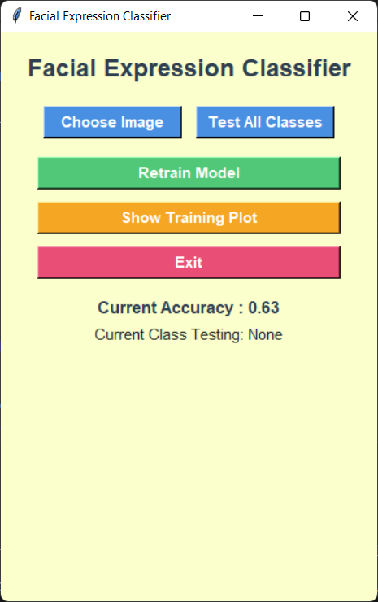

# Facial Expression Detector (GUI Test)

A simple CNN model with a GUI.

## Basic Feature 

 Retrain the model if unsatisfied
 Upload **TEST** image if needed to check expressions

## How to Run

Make sure you have Python 3.x installed.

1. Clone or download this repository.

**Libraries need open cmd paste this**

```bash

pip install numpy pandas matplotlib seaborn tensorflow scikit-learn

pip install Keras-Preprocessing

```

2. Run the Python script: **main.py*

# GUI Example

