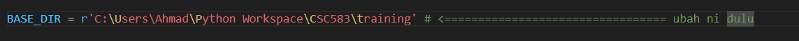
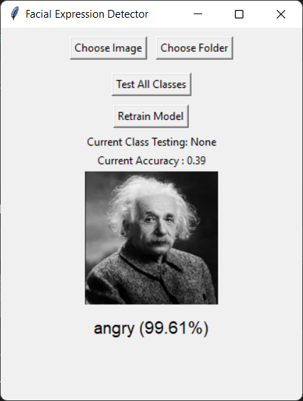
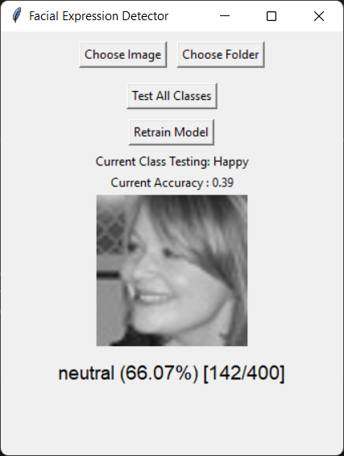
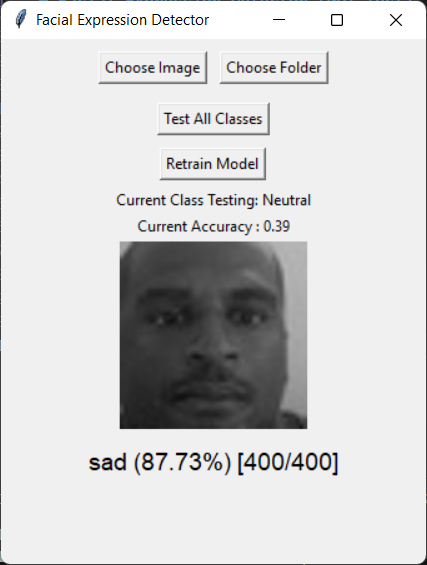
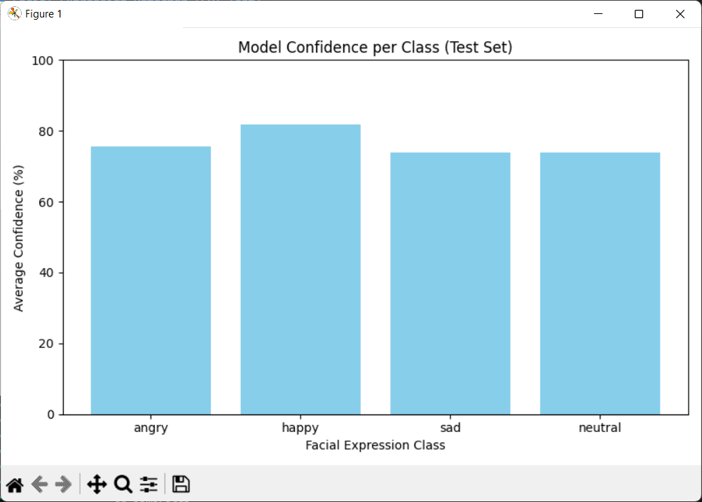

# Facial Expression Detector (GUI Test)

hehe

1. Download as Zip atau fork

2. run **auto_install.cmd* (Download python library kalau dah ada python)

3. Edit the Python script: **main.py*

4. Run **main.py* mula2 mmg slow enjoy

# GUI Example

